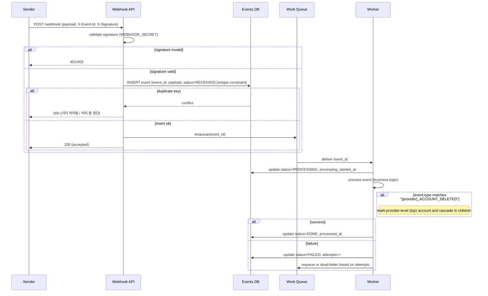

```mermaid
sequenceDiagram
  participant Sender
  participant API as Webhook API
  participant DB as Events DB
  participant Queue as Work Queue
  participant Worker

  Sender->>API: POST /webhook (payload, X-Event-Id, X-Signature)
  API->>API: validate signature (WEBHOOK_SECRET)
  alt signature invalid
    API-->>Sender: 401/403
  else signature valid
    API->>DB: INSERT event (event_id, payload, status=RECEIVED) [unique constraint]
    alt duplicate key
      DB-->>API: conflict
      API-->>Sender: 200 (이미 처리됨 / 처리 중 판단)
    else insert ok
      API->>Queue: enqueue(event_id)
      API-->>Sender: 200 (accepted)
    end
  end

  Queue->>Worker: deliver event_id
  Worker->>DB: update status=PROCESSING, processing_started_at
  Worker->>Worker: process event (business logic)
  alt event.type matches "{provider}_ACCOUNT_DELETED"
    note right of Worker: mark provider-level (top) account and cascade to children
  end
  alt success
    Worker->>DB: update status=DONE, processed_at
  else failure
    Worker->>DB: update status=FAILED, attempts++
    Worker->>Queue: requeue or dead-letter based on attempts
  end
```
