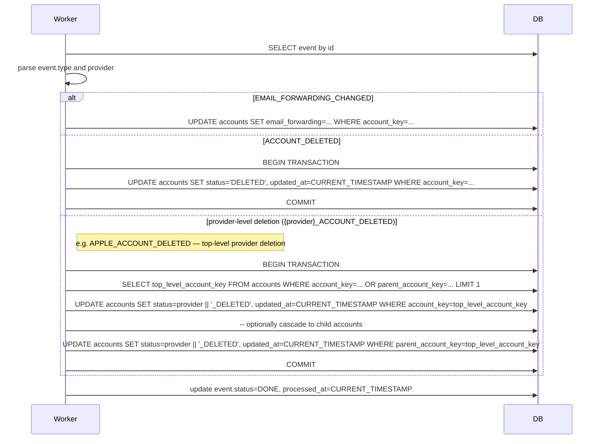

```mermaid
sequenceDiagram
  participant Worker
  participant DB
  Worker->>DB: SELECT event by id
  Worker->>Worker: parse event.type and provider
  alt EMAIL_FORWARDING_CHANGED
    Worker->>DB: UPDATE accounts SET email_forwarding=... WHERE account_key=...
  else ACCOUNT_DELETED
    Worker->>DB: BEGIN TRANSACTION
    Worker->>DB: UPDATE accounts SET status='DELETED', updated_at=CURRENT_TIMESTAMP WHERE account_key=...
    Worker->>DB: COMMIT
  else provider-level deletion ({provider}_ACCOUNT_DELETED)
    note right of Worker: e.g. APPLE_ACCOUNT_DELETED — top-level provider deletion
    Worker->>DB: BEGIN TRANSACTION
    Worker->>DB: SELECT top_level_account_key FROM accounts WHERE account_key=... OR parent_account_key=... LIMIT 1
    Worker->>DB: UPDATE accounts SET status=provider || '_DELETED', updated_at=CURRENT_TIMESTAMP WHERE account_key=top_level_account_key
    Worker->>DB: -- optionally cascade to child accounts
    Worker->>DB: UPDATE accounts SET status=provider || '_DELETED', updated_at=CURRENT_TIMESTAMP WHERE parent_account_key=top_level_account_key
    Worker->>DB: COMMIT
  end
  Worker->>DB: update event.status=DONE, processed_at=CURRENT_TIMESTAMP
```
