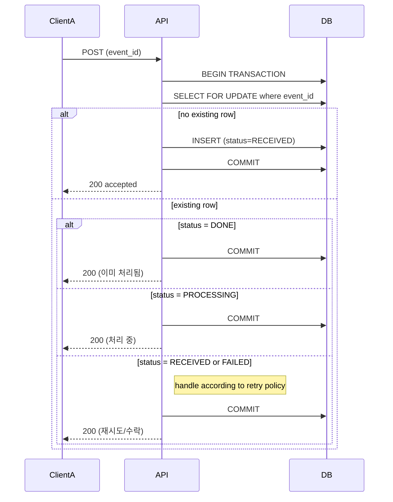

```mermaid
sequenceDiagram
  participant ClientA
  participant API
  participant DB

  ClientA->>API: POST (event_id)
  API->>DB: BEGIN TRANSACTION
  API->>DB: SELECT FOR UPDATE where event_id
  alt no existing row
    API->>DB: INSERT (status=RECEIVED)
    API->>DB: COMMIT
    API-->>ClientA: 200 accepted
  else existing row
    alt status = DONE
      API->>DB: COMMIT
      API-->>ClientA: 200 (이미 처리됨)
    else status = PROCESSING
      API->>DB: COMMIT
      API-->>ClientA: 200 (처리 중)
    else status = RECEIVED or FAILED
      note right of API: handle according to retry policy
      API->>DB: COMMIT
      API-->>ClientA: 200 (재시도/수락)
    end
  end
```
